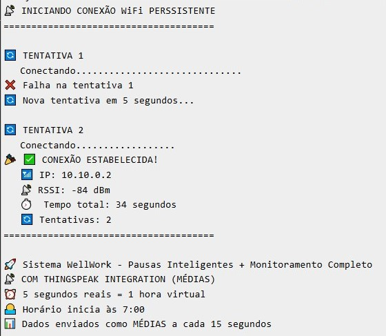
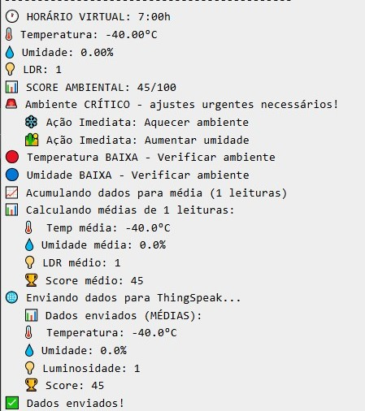

# 🏢 WellWork - Sistema Inteligente de Monitoramento Ambiental

## Link do projeto:

https://wokwi.com/projects/447791702511263745

https://thingspeak.mathworks.com/channels/3170636

## Identificação do problema:

### 🎯 Desafio no Futuro do Trabalho:

Com a ascensão do trabalho remoto e híbrido, profissionais enfrentam novos desafios ambientais que impactam diretamente sua produtividade, saúde e bem-estar:

 - ❌ Ambientes inadequados: Temperatura, umidade e iluminação fora dos padrões ideais
 - ❌ Sedentarismo digital: Longas horas em frente às telas sem pausas adequadas
 - ❌ Falta de ergonomia: Posturas inadequadas levando a LER/DORT
 - ❌ Isolamento: Perda da rotina estruturada do ambiente corporativo
 - ❌ Baixa produtividade: Ambiente inadequado reduz em até 30% a eficiência no trabalho

### Solução Proposta:

### 🚀 WellWork - Monitoramento Ambiental Inteligente:

Sistema IoT integrado que transforma qualquer espaço de trabalho em um ambiente saudável, produtivo e inteligente através de monitoramento em tempo real e intervenções proativas.

### 🚀 Funcionalidades
- ✅ **Monitoramento Ambiental**: Temperatura, umidade e luminosidade
- ✅ **Sistema de Scoring**: Avaliação da saúde ambiental (0-100 pontos)
- ✅ **Pausas Inteligentes**: Alertas para café, almoço e alongamentos
- ✅ **Alertas Visuais**: LEDs indicadores de condições inadequadas
- ✅ **Dashboard em Tempo Real**: Integração com ThingSpeak
- ✅ **Tomada de Decisão**: Recomendações automatizadas baseadas em dados

### 🛠️ Tecnologias Utilizadas
- **Microcontrolador**: ESP32
- **Sensores**: DHT22 (Temperatura/Umidade), LDR (Luminosidade)
- **Atuadores**: LEDs, Buzzer
- **Comunicação**: HTTP/REST API
- **Cloud**: ThingSpeak (Dashboard e gráficos)
- **Plataforma**: Wokwi Simulator


### 📦 Hardware
| Componente | Função |
|------------|--------|
| ESP32 | Processamento principal |
| DHT22 | Sensor de temperatura e umidade |
| LDR | Sensor de luminosidade |
| LEDs | Alertas visuais (vermelho, azul, amarelo, verde) |
| Buzzer | Alertas sonoros para pausas |

### 📊 Dashboard ThingSpeak
O sistema envia dados para o ThingSpeak com 4 campos:
- 🌡️ Temperatura (°C)
- 💧 Umidade (%)
- 💡 Luminosidade (0-4095)
- 🏆 Score de Saúde Ambiental (0-100)


### 🧠 Lógica do Sistema Inteligente

```bash
int calcularScoreSaudeAmbiental() {
  int score = 100; // Score perfeito
  
  // Penalidades por condições inadequadas
  if (temp > 28.0 || temp < 18.0) score -= 30;
  if (umidade > 70.0 || umidade < 30.0) score -= 25;
  if (escuro && hora >= 8 && hora <= 17) score -= 20;
  if (!escuro && (hora >= 20 || hora < 6)) score -= 15;
  
  return max(score, 0);
}
```

### 🌐 Comunicação HTTP

#### 📡 Endpoints HTTP Utilizados

```bash
// Endpoint Principal
POST http://api.thingspeak.com/update

// Parâmetros da Requisição
?api_key=8SMHZFKBKRSXQRAF
&field1=25.7          // Temperatura (°C)
&field2=47.0          // Umidade (%)
&field3=2150          // Luminosidade
&field4=85            // Score Saúde Ambiental

// Exemplo de URL Completa
http://api.thingspeak.com/update?api_key=8SMHZFKBKRSXQRAF&field1=25.7&field2=47.0&field3=2150&field4=85
```

#### Código de Implementação

```bash
void enviarParaThingSpeak(float temperatura, float umidade, int luminosidade, int score) {
  HTTPClient http;
  String url = "http://api.thingspeak.com/update";
  url += "?api_key=" + String(THINGSPEAK_API_KEY);
  url += "&field1=" + String(temperatura, 1);
  url += "&field2=" + String(umidade, 1);
  url += "&field3=" + String(luminosidade);
  url += "&field4=" + String(score);
  
  http.begin(url);
  int httpCode = http.GET();
  
  if (httpCode == HTTP_CODE_OK) {
    String resposta = http.getString();
    Serial.println("✅ Dados enviados! Entry: " + resposta);
  }
  http.end();
}
```

#### Fluxo de comunicação

```bash
ESP32 → WiFi → HTTP POST → ThingSpeak API → Dashboard
    ↓
Sensores (DHT22, LDR) → Processamento → Envio HTTP
```

### 🎯 Como Funciona
1. **Coleta de Dados**: Sensores monitoram ambiente a cada 2.5s
2. **Processamento**: Calcula score baseado em condições ideais
3. **Tomada de Decisão**: Emite alertas e recomendações
4. **Dashboard**: Envia médias a cada 15s para ThingSpeak
5. **Pausas Programadas**: Alertas sonoros e visuais conforme horário virtual

### 📈 Exemplo de Saída





## Impacto e Relevância:

### 🔮 Relevância para o Futuro do Trabalho
 - 🏠 Padroniza qualidade ambiental em home offices
 - 🌍 Democratiza acesso a ambientes de trabalho saudáveis
 - 📊 Dados concretos para políticas de trabalho remoto

### Educação Digital:
 - 🎓 Ensina princípios de ergonomia digital
 - 📚 Promove consciência ambiental no trabalho
 - 🔬 Base científica para hábitos saudáveis

### Sustentabilidade:
 - ⚡ Otimização energética através de monitoramento
 - 🌿 Redução do desperdício com controle ambiental
 - 📉 Diminuição da pegada de carbono
