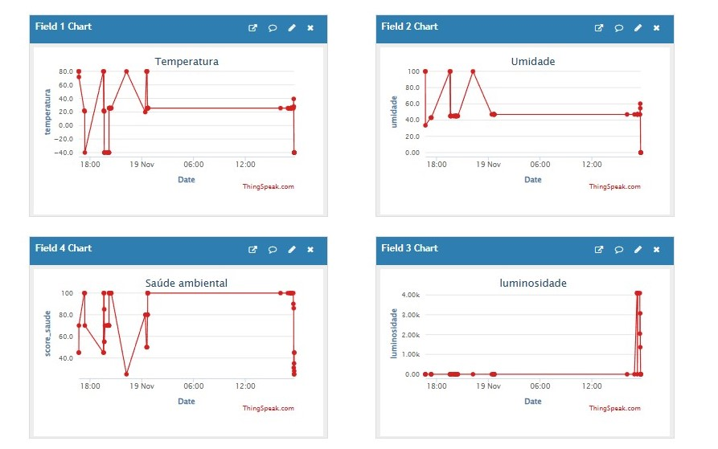

# 🏢 WellWork - Sistema Inteligente de Monitoramento Ambiental

## 📖 Sobre o Projeto
Sistema IoT com ESP32 para monitoramento inteligente do ambiente de trabalho, promovendo produtividade, saúde ocupacional e bem-estar através de sensores e automação.

## 🚀 Funcionalidades
- ✅ **Monitoramento Ambiental**: Temperatura, umidade e luminosidade
- ✅ **Sistema de Scoring**: Avaliação da saúde ambiental (0-100 pontos)
- ✅ **Pausas Inteligentes**: Alertas para café, almoço e alongamentos
- ✅ **Alertas Visuais**: LEDs indicadores de condições inadequadas
- ✅ **Dashboard em Tempo Real**: Integração com ThingSpeak
- ✅ **Tomada de Decisão**: Recomendações automatizadas baseadas em dados

## 🛠️ Tecnologias Utilizadas
- **Microcontrolador**: ESP32
- **Sensores**: DHT22 (Temperatura/Umidade), LDR (Luminosidade)
- **Atuadores**: LEDs, Buzzer
- **Comunicação**: HTTP/REST API
- **Cloud**: ThingSpeak (Dashboard e gráficos)
- **Plataforma**: Wokwi Simulator

## 📦 Hardware
| Componente | Função |
|------------|--------|
| ESP32 | Processamento principal |
| DHT22 | Sensor de temperatura e umidade |
| LDR | Sensor de luminosidade |
| LEDs | Alertas visuais (vermelho, azul, amarelo, verde) |
| Buzzer | Alertas sonoros para pausas |

## 📊 Dashboard ThingSpeak
O sistema envia dados para o ThingSpeak com 4 campos:
- 🌡️ Temperatura (°C)
- 💧 Umidade (%)
- 💡 Luminosidade (0-4095)
- 🏆 Score de Saúde Ambiental (0-100)

## 🎯 Como Funciona
1. **Coleta de Dados**: Sensores monitoram ambiente a cada 2.5s
2. **Processamento**: Calcula score baseado em condições ideais
3. **Tomada de Decisão**: Emite alertas e recomendações
4. **Dashboard**: Envia médias a cada 15s para ThingSpeak
5. **Pausas Programadas**: Alertas sonoros e visuais conforme horário virtual

## 📈 Exemplo de Saída

