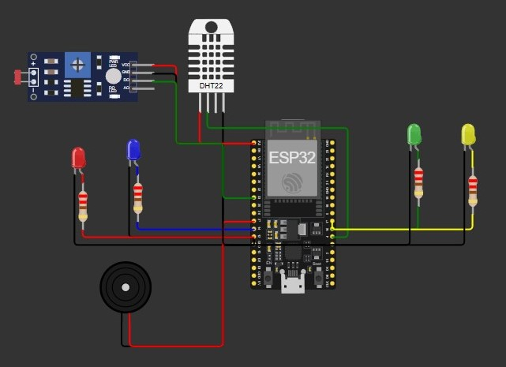

# 🏢 WellWork - Sistema Inteligente de Monitoramento Ambiental

## 📖 Sobre o Projeto
Sistema IoT com ESP32 para monitoramento inteligente do ambiente de trabalho, promovendo produtividade, saúde ocupacional e bem-estar através de sensores e automação.

## 🚀 Funcionalidades
- ✅ **Monitoramento Ambiental**: Temperatura, umidade e luminosidade
- ✅ **Sistema de Scoring**: Avaliação da saúde ambiental (0-100 pontos)
- ✅ **Pausas Inteligentes**: Alertas para café, almoço e alongamentos
- ✅ **Alertas Visuais**: LEDs indicadores de condições inadequadas
- ✅ **Dashboard em Tempo Real**: Integração com ThingSpeak
- ✅ **Tomada de Decisão**: Recomendações automatizadas baseadas em dados

## 🛠️ Tecnologias Utilizadas
- **Microcontrolador**: ESP32
- **Sensores**: DHT22 (Temperatura/Umidade), LDR (Luminosidade)
- **Atuadores**: LEDs, Buzzer
- **Comunicação**: HTTP/REST API
- **Cloud**: ThingSpeak (Dashboard e gráficos)
- **Plataforma**: Wokwi Simulator

